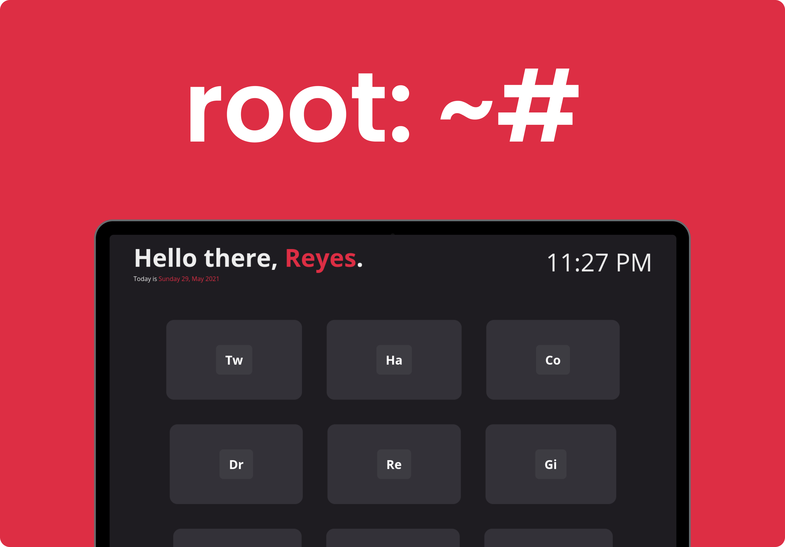

### Root is a start-page aimed to simplicity and elegance

This project is blazing fast :zap:, it only contains an html, css and javascript files.

## Customizing

Root was created to be lightweight, fast and easy to customize.

### Changing Colors

To change the colors used in the startpage edit `styles.css`.

```css
:root {
  --primary: #dd2e44;
  --text-light: #eeeeee;
  --background: #1e1c21;
  --background-light: #333138;
}
```

### Changing Name and Adding Custom Cards

> This project uses [Remix Icons](https://remixicon.com/).

To change the default name and edit the cards, edit `app.js`. It should look something like this:

```js
const NAME = "John Doe";

const CARDS = [
  {
    name: "Twitter",
    icon: "ri-twitter-fill",
    link: "https://twitter.com",
  },
  {
    name: "Github",
    icon: "ri-github-fill",
    link: "https://github.com/",
  },
];
```

To add a new card, just append a new object to the `CARDS` constant. The object should look something like this:

```js
{
  name: "<Webpage Name>",
  icon: "<Icon Class-Name>",
  link: "<Webpage Link>",
  clipboard: true,
  color: '#550499'
},
```

> To get the icon class-name, just go to [Remix Icons](https://remixicon.com/), select the desired icon. You should see something like this: `<i class="this-is-the-class-name"></i>`.

> If you prefer to copy the link to the clipboard instead of the default behavior, just add `clipboard: true` to the card object.

> Optional individual card accent color can be achieved by setting a `color: string` property in the card object. 

To use 24 hour time simply change the time section of `app.js` to
```
// Update the Time
  currentTime.innerHTML = `${currentHour}:${currentMinute}`;
```
